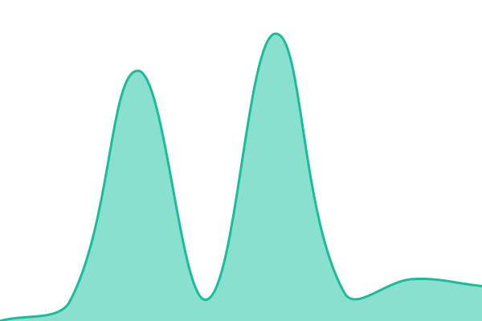

# [📈 Live Status](https://demo.upptime.js.org): <!--live status--> **🟩 All systems operational**

This repository contains the open-source uptime monitor and status page for [MD. Hasan](https://p4n3l.indevs.in), powered by [Upptime](https://github.com/upptime/upptime).

With [Upptime](https://upptime.js.org), you can get your own unlimited and free uptime monitor and status page, powered entirely by a GitHub repository. We use [Issues](https://github.com/oneandonlyhasan7-design/Farland_status/issues) as incident reports, [Actions](https://github.com/oneandonlyhasan7-design/Farland_status/actions) as uptime monitors, and [Pages](https://demo.upptime.js.org) for the status page.

<!--start: status pages-->
<!-- This summary is generated by Upptime (https://github.com/upptime/upptime) -->
<!-- Do not edit this manually, your changes will be overwritten -->
<!-- prettier-ignore -->
| URL | Status | History | Response Time | Uptime |
| --- | ------ | ------- | ------------- | ------ |
|  [FARLAND Main Website](https://p4n3l.indevs.in/) | 🟩 Up | [farland-main-website.yml](https://github.com/oneandonlyhasan7-design/Farland_status/commits/HEAD/history/farland-main-website.yml) | 

 357ms
     
 | 

<a href="https://status.farland.qzz.io/history/farland-main-website">100.00%</a>
    

|  [FARLAND Documentation](https://p4n3l.indevs.in/legal) | 🟩 Up | [farland-documentation.yml](https://github.com/oneandonlyhasan7-design/Farland_status/commits/HEAD/history/farland-documentation.yml) | 

 241ms
     
 | 

<a href="https://status.farland.qzz.io/history/farland-documentation">100.00%</a>
    

|  [FARLAND Services](https://p4n3l.indevs.in/services/) | 🟩 Up | [farland-services.yml](https://github.com/oneandonlyhasan7-design/Farland_status/commits/HEAD/history/farland-services.yml) | 

 142ms
     
 | 

<a href="https://status.farland.qzz.io/history/farland-services">100.00%</a>
    

|  [FARLAND Education](https://shahidbh.farland.qzz.io) | 🟩 Up | [farland-education.yml](https://github.com/oneandonlyhasan7-design/Farland_status/commits/HEAD/history/farland-education.yml) | 

 321ms
     
 | 

<a href="https://status.farland.qzz.io/history/farland-education">100.00%</a>
    

<!--end: status pages-->

[**Visit our status website →**](https://demo.upptime.js.org)

## 📄 License

- Powered by: [Upptime](https://github.com/upptime/upptime)
- Code: [MIT](./LICENSE) © [Anand Chowdhary](https://anandchowdhary.com)
- Data in the `./history` directory: [Open Database License](https://opendatacommons.org/licenses/odbl/1-0/)
